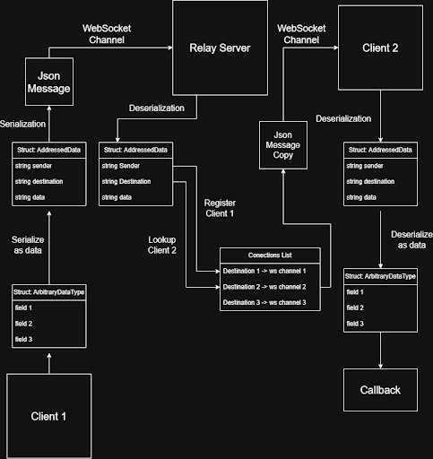

# Sockets [U](https://en.wikipedia.org/wiki/Union_(set_theory)) Serialization (SUS)

An implementation agnostic IPC communications system and specification based on WebSockets and JSON.

# Architecture

The communication protocol is described by the following diagram



# Building

Installation instructions for the dependencies `libhv` and `boost` – which were used to write the Relay Server and example clients – are included here.

## Dependencies

1. Download libhv: https://github.com/ithewei/libhv

2. Install libhv:

```
cd libhv
mkdir build && cd build
cmake ..
make -j$(nproc)
sudo make install
```

3. Download boost (version >= 1.90): https://www.boost.org/doc/user-guide/getting-started.html#from-source

```
git clone https://github.com/boostorg/boost.git -b boost-1.90.0 boost_1_90_0 --depth 1 
cd boost_1_90_0
git submodule update --depth 1 --init --recursive
```

4. Install boost:

```
cd boost_1_90_0/
mkdir build && cd build
cmake ..
cmake --build .
cmake --build . --target install
```

## Compiler version
5. Ensure you have G++-13 installed (for C++ 20)

if the major version number of `g++ --version` is 13 or higher, continue to the next section

```
cd ~
sudo apt update 
sudo apt install -y software-properties-common 

sudo add-apt-repository ppa:ubuntu-toolchain-r/test 
sudo apt update 

sudo apt install -y gcc-13 g++-13
```

## Build project
6. Build relay server and examples from source

```
cd Sockets-U-Serialization
cmake -S ./ws_server -B ./build -DCMAKE_C_COMPILER=gcc-13 -DCMAKE_CXX_COMPILER=g++-13
cmake --build ./build
```

# Examples
If you are using C++, you can follow the example files here in /src for creating a node with a libhv client. 

in one thread run

`./build/relay_server`

in another run

`./build/client1`

and another run

`./build/client2`